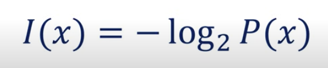
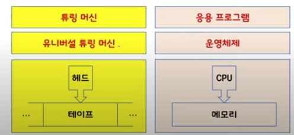
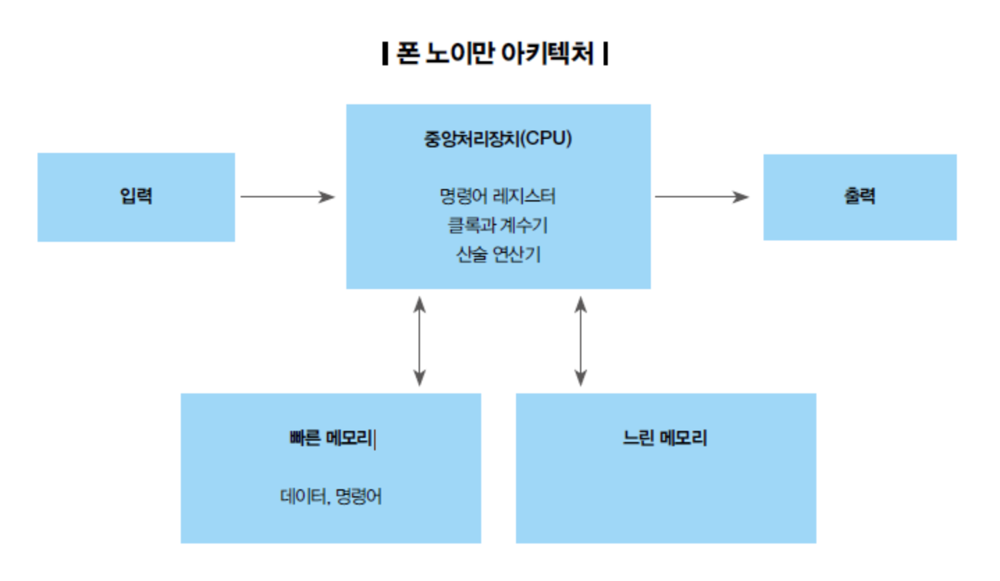
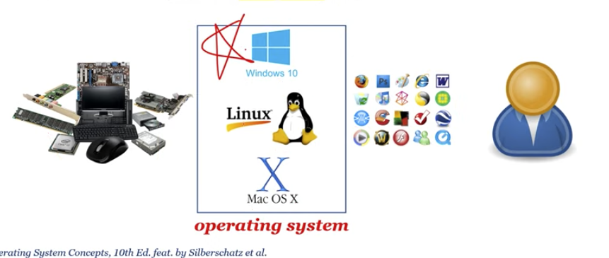

# 운영체제 
- An operating system is a software that operates a "computer" system
- 하드웨어를 제어하는, 그리고 사용자와 어플리케이션 프로그램에 서비스를 제공하는 소프트웨어를 운영체제라 한다.

## 컴퓨터
- 스마트폰 -> computer
- A computer is a machine that processes the "information"

## 정보

- 클로드 섀넌이 정의 
- bit(binary digit)
- An information can be defined as 
  - 불확실성을 측정하는 정량적(수치) 표현

## 컴퓨터가 정보를 어떻게 처리 ?
- 정보의 최소 단위 : bit (binary digit)
- 정보의 처리 : 정보의 상태 변환 (0에서 1로, 1에서 0으로)
- 부울 대수 (Boolean Algebra) : NOT, AND, OR
- 논리 게이트 : NOT, AND, OR, XOR, NAND, NOR
- 논리 회로 : IC, LSI, VLSI, ULSI, SoC, ....
  - 무어의 법칙, 황의 법칙
- 정보의 저장과 전송 : 플립-플롭, 데이터 버스

## 그래서, 컴퓨터가 정보를 어떻게 처리?
- 덧셈 : 반가산기, 전가산기
- 뺄셈 : 2의 보수 표현법
- 곱셈과 나눗셈 : 덧셈과 뺄셈의 반복
- 실수 연산 : 부동 소수점 표현법 => GPU
- 함수 : GOTO
- 삼각함수, 미분, 적분, 사진 촬영, 동영상 재생, ...

## 컴퓨터가 만능 ?
- 범용성 : universality
  - NOT, AND, OR 게이트만으로 모든 계산을 할 수 있다.
  - NAND 게이트만으로 모든 계산을 할 수 있다.
  - 범용 컴퓨터 : general-purpose computer
- 계산 가능성 : computability
  - Turing-computable : 튜링 머신으로 계산가능한 것
  - 정지 문제 : Halting Problem : 튜링 머신으로 풀 수 없는 문제.

## 컴퓨터는 누가 만들었나
- 컴퓨터의 할아버지
  - Alan Turing - Turing machine
- 컴퓨터의 아버지
  - John von Neumann - ISA : Instruction Set Architecture

## 앨런 튜링이 왜 컴퓨터의 할아버지?

- Head, Tape, Turing Machines, Universal Turing Machine
- CPU, RAM, Application Programs, Operating system (현대 컴퓨터의 원형을 제시)

## 폰 노이만이 왜 컴퓨터의 아버지?

- A stored-program computer is
  - a computer that stores programs in a memory.
- 프로그램 내장방식 컴퓨터를 최초로 제안

 
## 프로그램
- 명령어의 집합
- 컴퓨터 하드웨어에 작업을 수행하도록 지시
- 명령어를 compile => 기계어
  - 기계어는 실제로 컴퓨터의 CPU가 읽어서 실행할 수 있는 0과 1로 이루어진 명령어의 조합이다. 이러한 각 명령어에 대해 사람이 알아보기 쉬운 니모닉 기호(mnemonic symbol)를 정해 사람이 좀 더 쉽게 컴퓨터의 행동을 제어할 수 있도록 한 것이 어셈블리 언어이다.

## 운영체제도 프로그램?
- Operating system
  - is a program running at all times on the computer
  - to provide system services to application programs
  - to manage "processes", resources, user interfaces, and so on

## 운영체제가 뭔가?

- An operating system is
  - a software that operates a computer system

